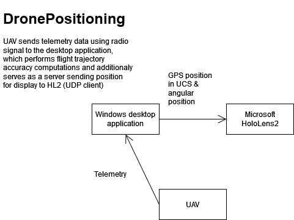
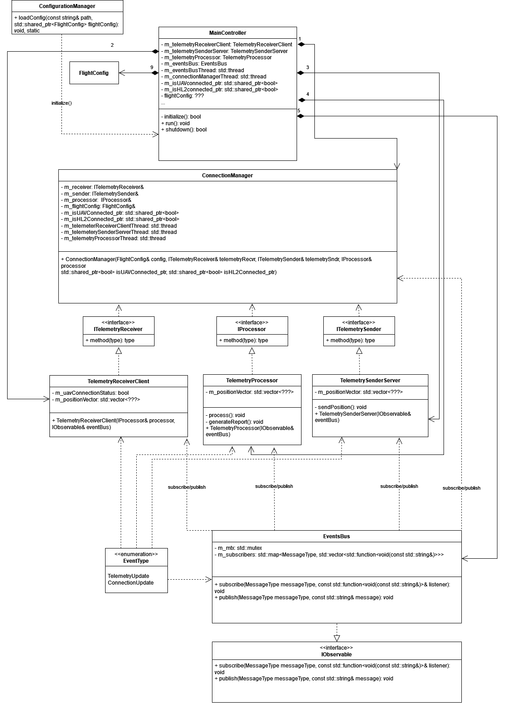
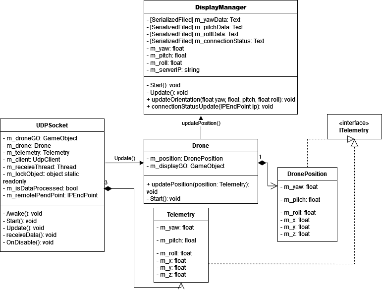

# DronePositioningV2
A training system for UAV operators using Augmented Reality technologies

## Architecture overview
### General
 

The scheme above is the general depiction of the system, which consists of three separate components:
- UAV: sends telemetry information: GPS&angular position, velocity and acceleration vectors through radio signals using [mavlink](https://mavlink.io/en/).
- Proxy machine: serves a role of both client listening for incoming UAV telemetry and server that sends position data to HL2 through UDP. It calculates accuracy metrics for flight trajcetory corectness evaluation and generates a final report after the session terminates.
- Microsoft HoloLens2: runs Unity application that receives UAV position as a UDP client and updates the scene. It is responsible for displaying of visual guidance tips for operator as well as visual feeback regarding colision with obstacles.

### Proxy


The schema above represents the architecture of the proxy, which consists of the following objects:

- ```MainController```: class which controls the main loop of the program. It is responsible for initializing the program to work: load configuration file -> instantiate receiver, sender and processor, managers -> make subscription for respective objects to ```EventsBus``` -> start receiver thread -> terminate the main loop
- ```ConfigurationManager```: utility class which parses configuration file and instantiate ```FlightConfig``` objects with data necessary
- ```ConnectionManager```: class handling connection between UAV and the program. Starts and joins receiver thread. Process connection events
- ```EventsBus```: object responsible for managing events flow in the application. Allows objects implementing ```ISubscriber``` interface to receive events of a specific topic as well as shares an internal publisher for objects to actually publish data
- ```TelemetryReceiver```: receiver that utilizes mavlink protocol for communication with the drone
- ```TelemetrySender```: server sending telemtry data packages via UDP to a remote endpoint
- ```TelemetryProcessor```: class implementing validation metricies for scoring the training session. Generates report after session terminates

### Microsoft HoloLens2


The diagram above represents the structure of Unity application running on HL2. Its main core is ```UDPSocket```, which listens to receive telemetry from a given ip address and later updates drone visualization.

### UAV
TODO