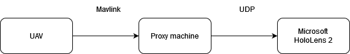
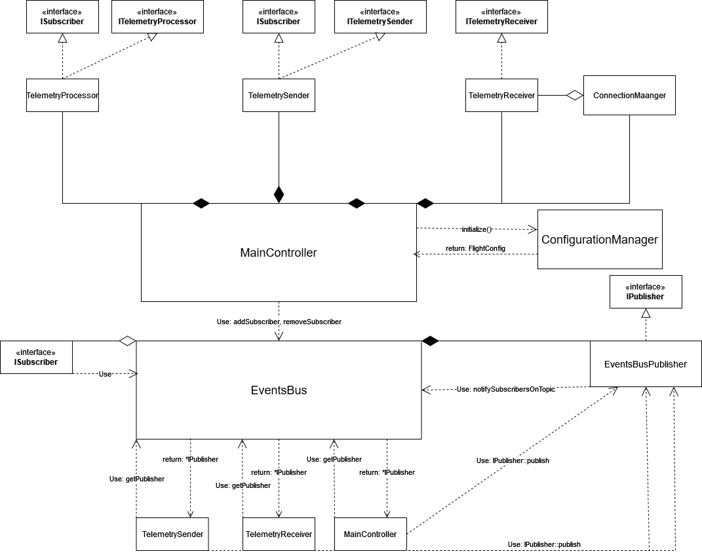

# DronePositioningV2
A training system for UAV operators using Augmented Reality technologies

## Architecture overview
### General
 

The scheme above is the general depiction of the system, which consists of three separate components:
- UAV: sends telemetry information: GPS&angular position, velocity and acceleration vectors through radio signals using [mavlink](https://mavlink.io/en/).
- Proxy machine: serves a role of both client listening for incoming UAV telemetry and server that sends position data to HL2 through UDP. It calculates accuracy metrics for flight trajcetory corectness evaluation and generates a final report after the session terminates.
- Microsoft HoloLens2: runs Unity application that receives UAV position as a UDP client and updates the scene. It is responsible for displaying of visual guidance tips for operator as well as visual feeback regarding colision with obstacles.

### Proxy


The schema above represents the architecture of the proxy, which consists of the following objects:

- ```MainController```: class which controls the main loop of the program. It is responsible for initializing the program to work: load configuration file -> instantiate receiver, sender and processor, managers -> make subscription for respective objects to ```EventsBus``` -> start receiver thread -> terminate the main loop
- ```ConfigurationManager```: utility class which parses configuration file and instantiate ```FlightConfig``` objects with data necessary
- ```ConnectionManager```: class handling connection between UAV and the program. Starts and joins receiver thread. Process connection events
- ```EventsBus```: object responsible for managing events flow in the application. Allows objects implementing ```ISubscriber``` interface to receive events of a specific topic as well as shares an internal publisher for objects to actually publish data
- ```TelemetryReceiver```: receiver that utilizes mavlink protocol for communication with the drone
- ```TelemetrySender```: server sending telemtry data packages via UDP to a remote endpoint
- ```TelemetryProcessor```: class implementing validation metricies for scoring the training session. Generates report after session terminates

### Microsoft HoloLens2


The diagram above represents the structure of Unity application running on HL2. Its main core is ```UDPSocket```, which listens to receive telemetry from a given ip address and later updates drone visualization.

### UAV
The core of the UAV and from the software perspective the only crucial component is the flight controller. For tests and validation this project used [CubePilot Orange Flight Controller](https://docs.px4.io/main/en/flight_controller/cubepilot_cube_orange.html). The flight controller was backed up by a dedicated GPS receiver. Any validation of and setup for the hardware was done by installing the firmware via [Mission Planner](https://ardupilot.org/planner/).


## Details
The following section dives deeper into the architecture and focuses on the [Proxy](README.md#proxy) part in particular.

### Events
The application can handle three events during its run:

- ```TelemetryEvent```: new telemetry data
- ```ConnectionEvent```: event related to connection status from either ```ITelemetryReceiver``` or ```ITelemetrySender```
- ```AppTerminationEvent```: signal to join threads and terminate the application

Each event is distinguished by its tag, which is published alongisde to one of these three different types of structures. ```IPublisher::publish``` method requires to use enum class ```EventsType``` for signaling specific topic. 

Publisher method utilizes a generic ```Event``` object created as ```std::variant``` out of ```TelemetryEvent```, ```ConnectionEvent```, ```AppTerminationEvent```. 

#### ISubscriber and IPublisher
Interfaces ```IPublisher``` and ```ISubscriber``` have to be implemented when a class wants to become a publisher or be able to subscribe to a given topic and be announced of new data at that topic by ```EventsBus```.

Every interface from the project utilizes [Template Method](http://www.gotw.ca/publications/mill18.htm). This means that publicly exposed generic method like ```IPublisher::publish``` or ```ISubscriber::onEvent``` uses internally a concrete implementation delivered by a class which implements an interface.

```ISubscriber::onEvent``` uses C++17 ```std::visit``` to handle generic ```Event``` that in fact is ```std::variant```. In order to deduce the type of ```Event``` and call correct concrete implementation ```ISubscriber::onEvent_``` another method ```ISubscriber::dispatchEvent``` is used and as it accepts template type ```T``` event it can call correct event handler. This comes with the price of first: ```std::visit``` has to iterate over its vector of types (can be negligible for only three types of events), second: to facilitate that approach ```ISubscriber``` has to deliver default implementation (empty) for each event type, as a concrete subscriber can handle multiple events, but it doesn't have to know how to handle all of them. Stress tests didn't prove that the given approach is responsible for a massive overhead.

```IPublisher``` in this project is only one and it is ```EventsBus::EventsBusPublisher```- an internal publisher of ```EventsBus```. Its concrete implementation of ```IPublisher::publish_``` method uses ```EventsBus::notifySubscribersOnTopic```. If an object wants to publish data to ```EventsBus``` it must obtain a non-owning pointer to ```EventsBus::EventsBusPublisher``` so it can access public ```IPublisher::publish```. With this approach only a single instance of publisher is used.

#### EventsBus
```EventsBus``` uses a map of subscribers with keys being attributes of enum class ```EventType``` and each field being a vector of weak pointers to ```ISubcriber``` objects. A priority for this section of the project was to make sure that process of handling new events by multiple subscribers happens smoothly. That is why ```EventsBus``` uses ```boost::asio::thread_pool``` with a number of worker threads to handle notifications all at once. No additional threads synchornization is required for this part given ```Event``` objects remain ```const```.


### Telemetry Utilities
TODO